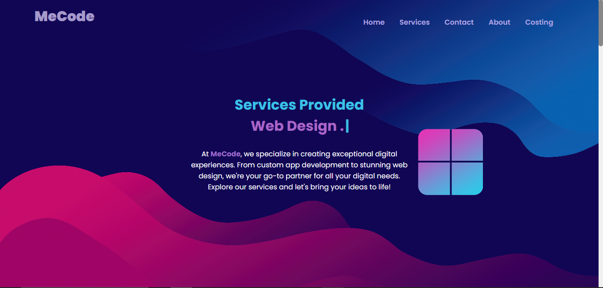
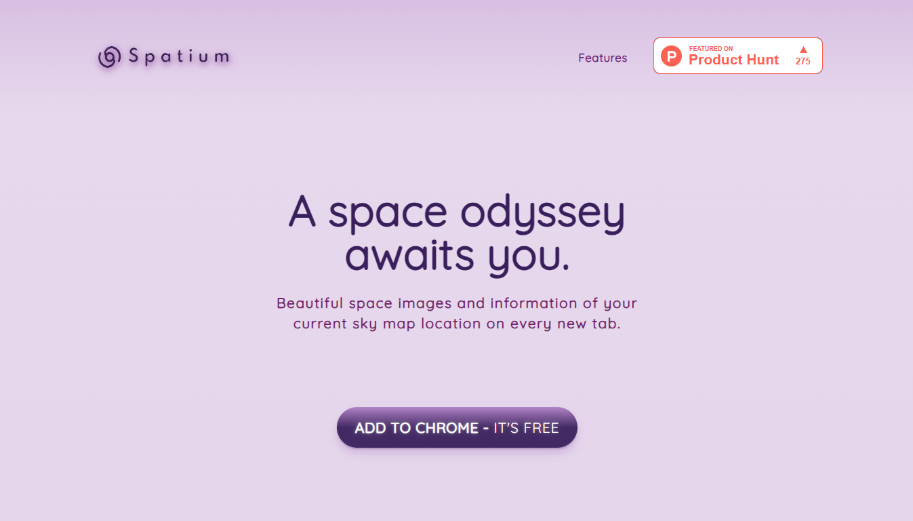
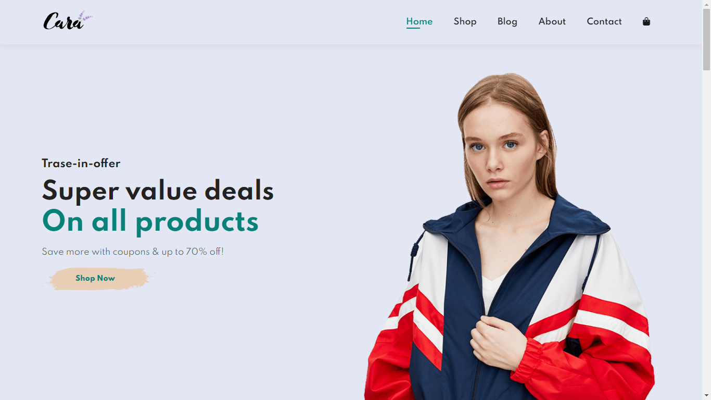
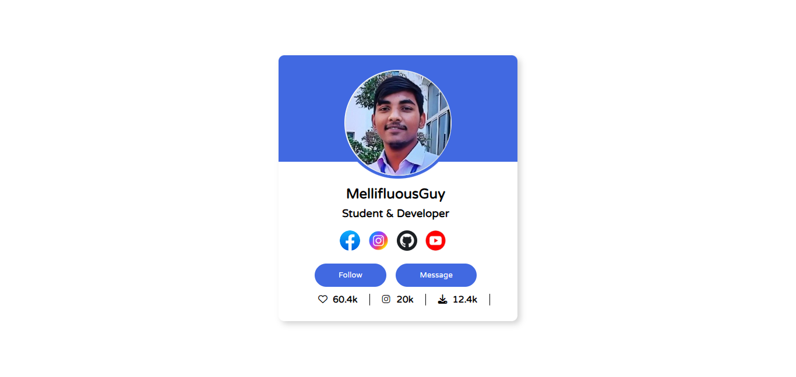

# Mohit Gupta's Portfolio

Welcome to my portfolio repository! This project showcases my skills, projects, and experiences as a web developer.

## Table of Contents
- [About](#about)
- [Technologies Used](#technologies-used)
- [Features](#features)
- [Projects](#projects)
- [Installation](#installation)
- [Usage](#usage)
- [Contact](#contact)

## About

I am Mohit Gupta, a Bachelor of Computer Application student at Techno Institute Of Higher Studies (2022-2025). This portfolio highlights my work, including various projects and tasks completed during my internship at InterPe and personal endeavors.

## Technologies Used

- HTML
- CSS
- JavaScript
- React.js
- Fetch API
- React Router

## Features

- **Responsive Design:** Accessible on various devices.
- **Interactive UI:** Engaging user interface with smooth navigation.
- **Project Showcase:** Detailed display of my projects with descriptions and screenshots.
- **Contact Form:** Allows visitors to get in touch with me easily.

## Projects

### Mecode
- **Description:** A service-based website built using React and React Routing.
- **Link:** [Mecode](https://github.com/Mellifluousguy/MeCode_Hub/)
- **Image:**
  

### Homepage Replica
- **Description:** A homepage replica made using HTML and CSS.
- **Link:** [Homepage Replica](https://github.com/Mellifluousguy/Responsive-Homepage-Replica)
- **Image:**
  

### E-commerce Website
- **Description:** An e-commerce website created using HTML and CSS.
- **Link:** [E-commerce Website](https://github.com/Mellifluousguy/E-commerce)
- **Image:**
  

### Login Card
- **Description:** A login card designed with HTML and CSS.
- **Link:** [Login Card](https://github.com/Mellifluousguy/Card)
- **Image:**
  

## Installation

To run this project locally, follow these steps:

1. **Clone the repository:**
   ```sh
   git clone https://github.com/Mellifluousguy/PortfolioReact.git
2. **Navigate to the project directory:**
   ```sh
   cd PortfolioReact
3. **Install dependencies:**
   ```sh
   npm install

### Usage

1. **Run the application:**
   ```sh
   npm start 
2. Open your browser and go to http://localhost:3000 to view the portfolio.

### Contact

Feel free to reach out to me through the following platforms:

- **Email:** mohitdeveloperg@gmail.com
- **LinkedIn:** linkedin.com/in/mellifluousguy
- **GitHub:** github.com/Mellifluousguy
